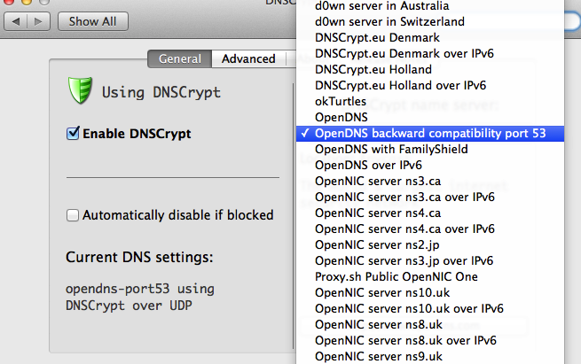

#Openwrt-hg255d

Openwrt configure of HG255D, used to cross the GFW

#Note:

此项目只为实现快速刷机(hg255d)

固件是自己compile的，用来快速刷机与恢复系统。详见下方步骤

内shadowsocks个人账号，请勿滥用，不确保长期有效

请勿经常性P2P下载（迅雷、电驴）

#Let's go:

主要包括 **刷空白系统** 和 **导入配置** 两步

1.	用网线将 电脑 和路由的 LAN 口相连，用牙签或笔 按住reset，开机，按住数秒后松开
1.	等待进入到uboot刷机界面。

		手动设置ip，子网掩码，网关，
		分别为 192.168.1.34（34可随意）, 255.255.255.0, 192.168.1.1，
		如果 ping 不通网关，可以换换ip地址试试；
		或手动设置网关 192.168.1.1 ，自动获取ip也可；

2.	上传固件，刷机开始，等待... 路由会自己重启
3.	等待完毕后，确认下能ping通网关
4.	默认无密码 telnet 192.168.1.1
4.	下载 overlay 备份，恢复备份

		cd /tmp
		wget http://trello-abc.stor.sinaapp.com/540c02c45ab1ef6669aa580428e5df5a3c7ff73cb162b.tar -O overlay_backup.tar
		rm -rf /overlay/*
		cd /
		tar zxvf /tmp/overlay_backup.tar

5.	reboot
6.	重启下网卡 sudo ifconfig en0 down, sudo ifcnfig en0 up
7.	用DHCP自动获取ip，你会发现ip地址变成了3的网段（比如：192.168.3.110）
8.	接下来你就可以自由畅游了...

##登录管理路由：
ssh root@192.168.3.1 或 网址登录 192.168.3.1

用户名: root, 密码: admin

开启无线后默认密码: helloworldFuckGFW

##连线注意事项：

谨记一条即可：连接路由器 **WAN** 口的线必须是可以直接插着电脑上网的，路由器 **LAN** 出来的线都是可以越过长城的

#Todo:

电信，联通dns解析皆正常，长城宽带dns解析间歇性异常。
打算使用dnscrypt 解决 长城宽带dns污染问题

#License

[MIT](http://opensource.org/licenses/MIT)
